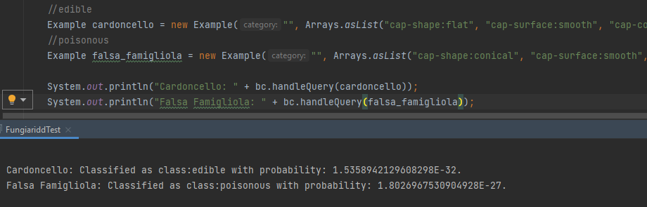
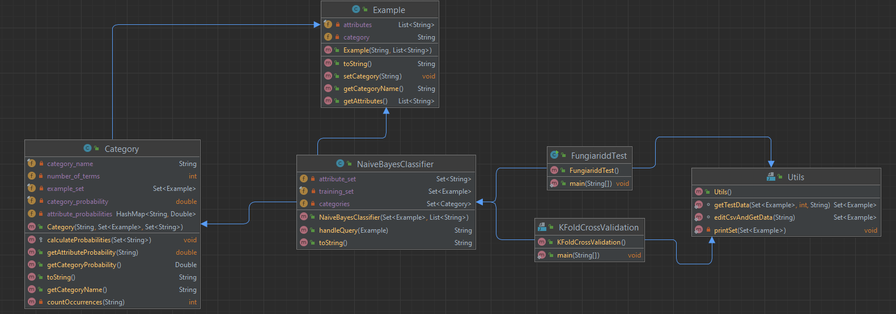

# <p style="text-align: center;">  </p>

## <p style="text-align: center;"> Corso di laurea triennale in Informatica del dipartimento di Informatica.</p>


# <p style="text-align: center;">  FUNGIARIDD</p>

## <p style="text-align: center;">  Caso di studio per il corso Ingegneria Della Conoscenza</p>

**Realizzato da:** Gabriele Grieco\
**Matricola:** 700234


## Indice
 1. [Introduzione](#1introduzione)
 2. [Il Dataset](#2il-dataset)
 3. [Linguaggo IDE e altri requisiti](#3linguaggio-ide-utilizzati-e-altri-requisiti)
 4. [Alforitmi implementati](#4algoritmi-implementati)
 5. [Struttura del progetto](#5struttura-del-progetto)


 ## 1.  Introduzione
Per la realizzazione del caso di studio ho scelto di trattare un'attività diffusa nel territorio dell'alta murgia pugliese, ovvero, la caccia dei funghi.\
 Il cacciatore di funghi **"fungiaridd"**, soprattutto colui che si improvvisa tale, corre il pericolo di raccogliere il fungo sbagliato; non è raro sentire di persone gravemente intossicate per l'ingestione di funghi velenosi o l'inalazione delle loro spore.

 Così ho ricercato un dataset sui funghi commestibili e non è da qui è nato Fungiaridd che classifica i funghi come Commestibili e Velenosi mediante una descrizione dei loro arrtibuti, per esempio la superficie del cappello, il suo colore la sua forma, la larghezza del gampo etc...

 ## 2. Il Dataset 

# <p style="text-align: center;">  </p>

Il [**Dataset**](https://www.kaggle.com/hatterasdunton/mushroom-classification-updated-dataset/) utilizzato si compone 8124 esempi di funghi (52% commestibili e 48% velenosi) classificati mediante la descrizione di 23 attributi:

- **class (classe di appartenenza)**: edible, poisonous
- **cap-shape (la forma del cappello):** bell, conical, convex, flat, knobbed, sunken
- **cap-surface** (la superficie del cappello):** fibrous, grooves, scaly, smooth
- **cap-color (il colore del cappello):** brown, buff, cinnamon, gray, green, pink, purple, red, white, yellow
- **bruises (presenta dei lividi/macchie):** bruises, no
- **odor (odore):** almond, anise, creosote, fishy, foul, musty, none, pungent, spicy
- **gill-attachment (attacco delle lamelle):** attached, descending, free, notched
- **gill-spacing (spaziatura tra le lamelle):** close, crowded, distant
- **gill-size (dimensione delle lamelle):** broad, narrow
- **gill-color (colore delle lamelle):** black, brown, buff, chocolate, gray, green, orange, pink, purple, red, white, yellow
- **stalk-shape (forma del gambo):** enlarging,tapering
- **stalk-root (radice):** bulbous, club, cup, equal, rhizomorphs, rooted, missing
- **stalk-surface-above-ring (superficie del gambo sopra l'anello):** fibrous, scaly, silky, smooth
- **stalk-surface-below-ring (superficie del gambo sotto l'anello):** fibrous, scaly, silky, smooth
- **stalk-color-above-ring (colore del gambo sopra l'anello):** brown, buff, cinnamon, gray, orange, pink, red, white, yellow
- **stalk-color-below-ring (colore del gambo sotto l'anello):** brown, buff, cinnamon, gray, orange, pink, red, white, yellow
- **veil-type (cuticola del fungo):** partial, universal
- **veil-color (colore della cuticola):** brown, orange, white, yellow
- **ring-number (numero di anelli): none, one, two
- **ring-type (tipo di anello):** cobwebby, evanescent, flaring, large, none, pendant, sheathing, zone
- **spore-print-color ():** black, brown, buff, chocolate, green, orange, purple, white, yellow
- **population (popolazione):** abundant, clustered, numerous, scattered, several, solitary
- **habitat:** grasses, leaves, meadows, paths, urban, waste, woods


 

 ## 3. Linguaggio IDE utilizzati e altri requisiti
 Per la realizzazione del classificatore e delle latre componenti è stato utilizzato il lingiaggio Java.
 - jdk versione 11+
    - Come ambiente di sviluppo java è stato utilizzato [**IntelliJ IDEA**](https://www.jetbrains.com/idea//).
 - viene utilizzato inoltre, maven per l'inclusione dell package  ```opencsv ```, il quale contiene una classe utility per la lettura di file csv (CSVReader).
 Aggiungere questa dipendenza nel file  ```pom.xml ``` sotto la voce ```<dependencies> </dependencies>```

 ```
        <dependency>
            <groupId>com.opencsv</groupId>
            <artifactId>opencsv</artifactId>
            <version>5.3</version>
        </dependency>
 ```

## 4. Algoritmi implementati
- **Classificatore di Naive Bayes:** classificatore probabilistico bastato sul Teorema di Bayes ma con assunzione di indipendenza degli attributi. La pobabilità Bayesiana usa il concetto di probabilità condizionata, ovvero la probabilità di un evento A considerando le informazioni disponibili sull'evento B ```P(A | B) = p(A)*p(B | A) / p(B)```
dove:
    - p(A) e p(B) sono probabilità a posteriori bastate sui dati storici;

    - p(A | B), p(B | A) sono le probabilità condizionate a posteriori.

    Naive Bayes permette di calcolare per ogni istanza la probabilità di appartenenza a una classe mediante il calcolo a priori della probabilità che un attributo Xn appartenga alla classe Yn tenendo conto delle informazioni di cui si è già in possesso, per esempio: Con quale probabilità un fungo dal cappello rosso (e denotato da altre coppie attributi:valore) appartiene alla classe Edible? Con quale alla classe Poisonous? P(cap-color:red | class:edible) e P(cap-color:red | class:poisonous) 

    1) Vengono divisi gli esempi del training set nelle varie categorie, in questo caso Commestibile e Velenoso;

    2) Per ogni categoria C viene calcolata la probabilità di essa dividendo il numero di esempi nella categoria (#esempiC) con il numero totale di esempi nel training set (#esempiTR):\
    ```#esempiC / #esempiTR```;

        


    3) Viene estratto dagli esempi di training un insieme (insieme
    _degli_attributi) di coppie attributo:valore senza ripetizione;

    4) A questo punto si calcola la probabilità a priori p(Xn | C) dividendo il numero di occorrenze nella categoria C di Xn (#Xn_in_C) con il numero totale di coppie attributo:valore nella categoria C (#coppie_in_C):\
     ```p(Xn | C) = #Xn_in_C / #coppie_in_C```;\
    Dato che una categoria può contenere coppie attributo:valore non presenti nelle altre categorie si possono ottenere probabilità nulle che, se presenti, possono rendere nulla la predizione senza prendere in considerazione le probabilità delle altre coppie.\
    Per evitare questo, viene utilizzata la correzione di Laplace (Laplace smoothing) che mdoifica la formula come segue:\
     ```p(Xn | C) = 1 + #Xn_in_C / #coppie_in_C  + |insieme degli attributi|```\
     permettendo ad ogni coppia di essere presente almeno una volta in ogni categoria

        

    5) Il classificatore è ora pronto per gestire delle query. In questa fase si controlla se la query ha delle coppie attributo valore non presenti nell insieme_degli_attributi, in tal caso queste vengono aggiuntee le probabilità a priori vengono ricalcolate.
    La query non è altro che un esempio per il quale bisogna predire la classe di appartenza e questa è composta da coppie attributo:valore (X1 = v1, X2 = v2, ... Xk = vk); per ogni categoria viene fatta una predizione di appartenenza:  
    ``` p(Cn | X) = p(Cn) * p(X1 = v1 | Cn) * p(X2 = v2 | Cn) * ... * p(Xk = vk | Cn)```.\
    La categoria che otterrà il valore maggiore sarà quella alla quale, con maggiore probabilità, il fungo descritto appartiene.

        

        Esempio di test

        

- **K-Fold Cross Validation:** algoritmo utilizzato per testare il sistema sulla sua accuratezza senza dover trascurare parte del training set per creare un test set.
K-Fold Cross Validation consiste nel dividere equamente il training set in k subsets, e in k iterazioni si usa 1 subset diverso dai precedenti come test set e tutti gli altri come training set.\
Per ogni interazione viene calcolato:
    - **True Edible:** corettamente predetti commestibili (TP);
    - **True Negative:** correttamente predetti velenosi (TN);
    - **False Positive:** erroneamente predetti commestibili (FP);
    - **False Negative:** erroneamente predetti velenosi (FN);
    - **Accuracy:** accurancy of the system with that subset as test calculated as ```TP + TN / (TP + TN + FP + FN) ```.

    Infine viene fatta una media delle k accuratezze.

    **Con k = 6:**

    
    

    **Con k = 12:**

    
    
    


## 5. Struttura del progetto
**Example**: classe che rappresenta query ed esempi del training set;

**Category**: classe che rappresenta una categoria del classificatore;

**NaiveBayesClassifier**: classe rappresentate il classificatore;

**Utils**: utility per la lettura di file csv e per la creazione dei set di training e test;




